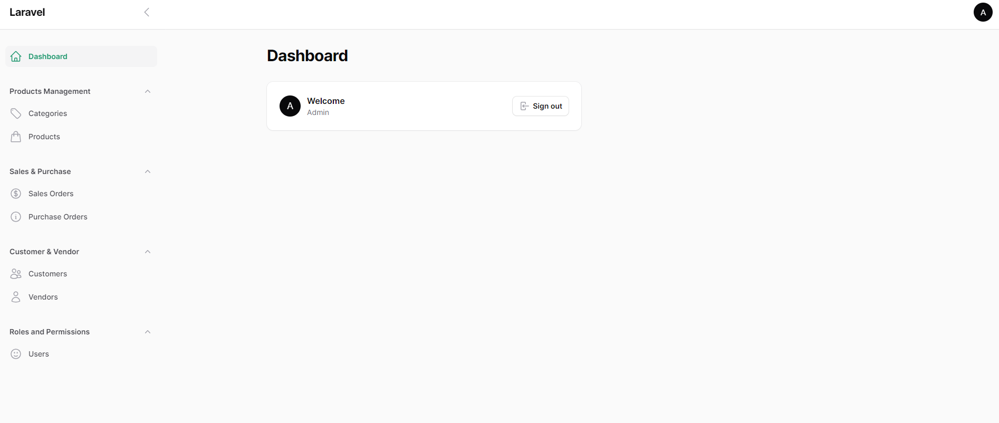
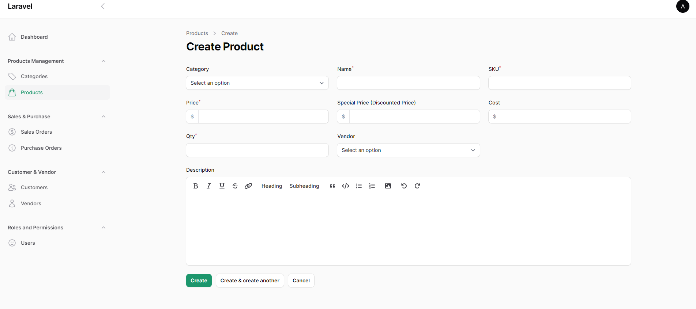
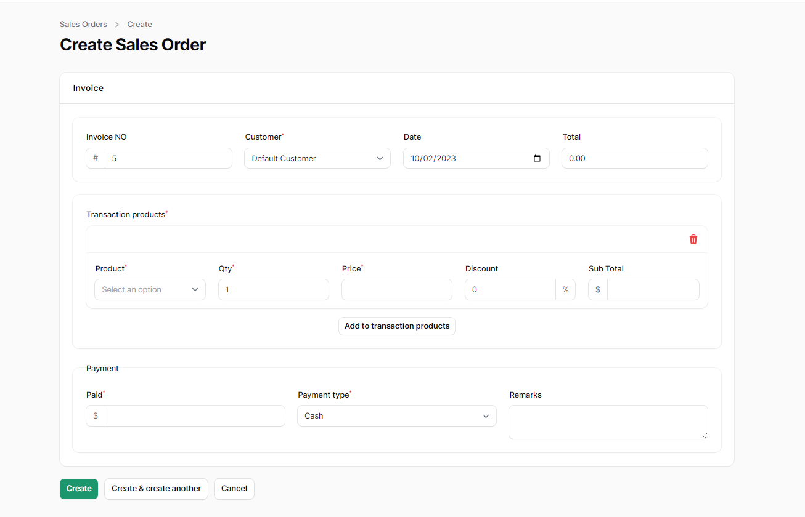

<h2>Filamentphp v3 Demo Inventory</h2>

<p>Inventory System built with Filamentphp with basic usage</p>
<p>Resources</p>
<ul>
<li>Product Management</li>
<li>Customer Management</li>
<li>Vendor Management</li>
<li>Vendor Management</li>
<li>Invoice</li>
<li>Stock-In</li>
</ul>

<h3Installation</h3>

Clone the Repository

````
composer install
php artisan migrate
php artisan db:seed
php artisan serve 
````
<p> Then visit http://127.0.0.1:8000/dashboard in your browser </p>

````
UserName: admin@gmail.com
Password: 12345678
````

<p>For more details <a href="https://filamentphp.com/" target="_blank">Filamentphp</a></p>

<h3>Screenshots</h3>






